# MUAY THAI BOXING CWMBRAN

This project idea muay thai boxing cwmbran came about as i wanted to build a real world site for my project instead of something made up, i used to be a part of this thai boxing camp and was quite close with the instructor so i reached out to him and asked him if he wanted me to build the club a website, the main reason for building the site was to have all the information, most importantly the schedule all in one place.

Muay thai boxing cwmbran hopes that it will give users all they need to join the club and find all the information necessary, it also aims to update current members on any schedule changes and at a later date an easier way to pay and monitor memberships.  
The intended audience for this project are as follows:

* Parents
* People that want to fight in competitions
* People that want to learn self defence
* People that want to improve fitness or mental health
* Someone looking for a hobby to pursue 
* Members of the camp  

This site benefits this demographic as it gives you all the information you need to join, updates on the schedule and an overview of the facilities available on-site.

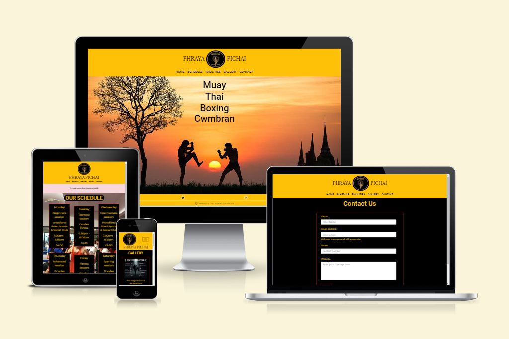  
Here is the link to my [live site](https://nap199i.github.io/Muay-thai-boxing-Cwmbran/).  
Here's the [am i responsive](https://ui.dev/amiresponsive?url=https://nap199i.github.io/Muay-thai-boxing-Cwmbran) site for my project.

## UX

My UX process was to go through a microsoft document that i made, it took me through the five planes of UX. I also had a meeting with the client (my old instructor) to see what was important to him to be included into the site, what his goal for the site was I.E who he wanted to use it, what the purpose of the site was, the color schemes, pages for the initial release and things we wanted to add in later releases.

### Colour Scheme

The color scheme used was yellow, black and red. These are camp colors and itemised below.

- `#ffc107` used for primary text, content titles, nav bar background and mobile menu text hover effect.
- `#ff0000` used for main content boarders and hover colors for social icons.
- `#000000` used for main content backgrounds where images were not used, nav bar headings and mobile menu background hover effect.
- `#ffdd79` used for text shadow on nav bar.

I used [coolors.co](https://coolors.co/ffc107-000000-ff0000-ffdd79) to generate my colour palette.

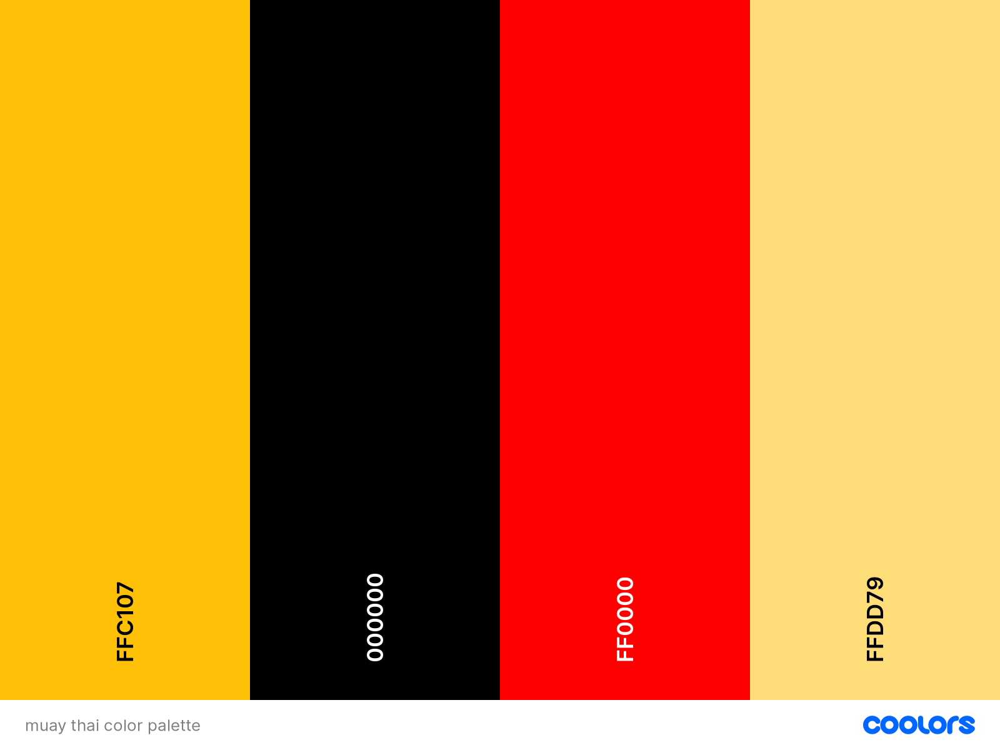

### Typography

The reason i picked these fonts were for a professional and clean look to the site.

- [Libre Baskerville](https://fonts.google.com/specimen/Libre+Baskerville?query=libre) was used for the main nav titles.

- [Roboto](https://fonts.google.com/specimen/Roboto?query=robo) was used for the primary headers and titles.

- [Montserrat](https://fonts.google.com/specimen/Montserrat) was used for the primary text throughout the site.

- [Font Awesome](https://fontawesome.com) icons were used throughout the site, such as the social media icons in the footer and back to top chevrons.

## User Stories

To help with this section, when i had the meeting with my client we discussed site admin goals and different user goals which has been shown below.

### New Site Users

- As a new site user, I would like to find out the location, so that I can join the camp.
- As a new site user, I would like to find out the schedule, so that I can join the camp.
- As a new site user, I would like to contact the camp administration, so that I can ask any questions I may have.
- As a new site user, I would like to find the price of the sessions, so that I can pay the correct amount when I join.
- As a new site user, I would like to find information on the sessions, so that I can pick which ones to attend.

### Returning Site Users

- As a returning site user, I would like to find the schedule, so that I can make sure there has been no changes.
- As a returning site user, I would like to look at the gallery, so that I can show people my friends and what I am a part of.
- As a returning site user, I would like to use the contact section, so that I can inform the instructor that I wont be able to make a session.

### Site Admin

- As a site administrator, I should be able to have our information displayed, so that I can update new and existing members on times, locations and prices.
- As a site administrator, I should be able to have images on the site, so that I can so potential new recruits can see what we do or so existing members can show friends.
- As a site administrator, I should be able to recieve and answer queries by email, so that I can assist anyone looking to join or any existing members issues.

## Wireframes

I've used [Balsamiq](https://balsamiq.com/wireframes) to design my site wireframes.

### Home Page Wireframes

| Size | Screenshot |
| --- | --- |
| Mobile | 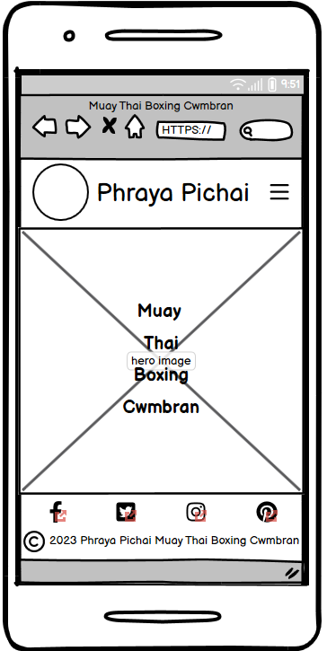 |
| Desktop | 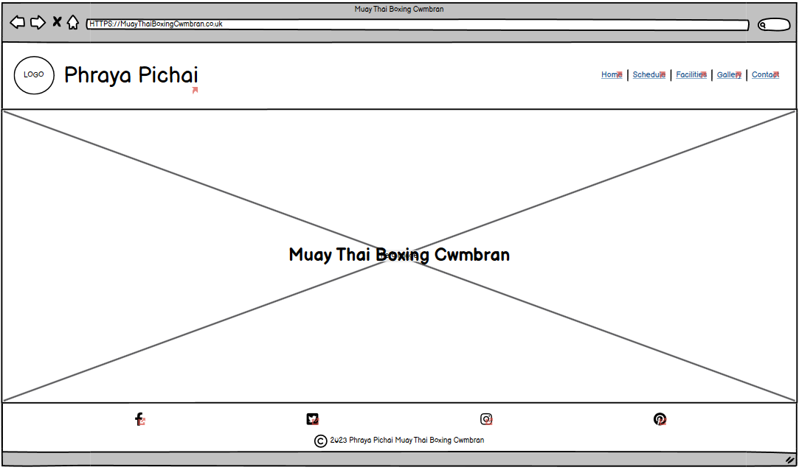 |

### Schedule Page Wireframes

| Size | Screenshot |
| --- | --- |
| Mobile | 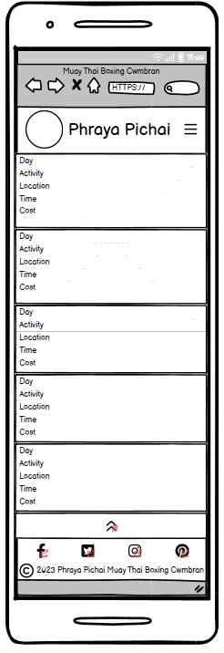 |
| Desktop | 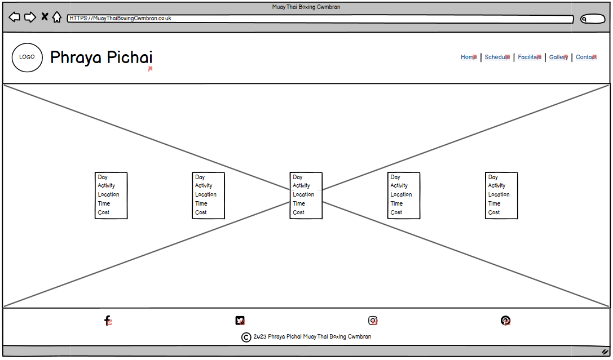 |

### Facilities Page Wireframes

| Size | Screenshot |
| --- | --- |
| Mobile | 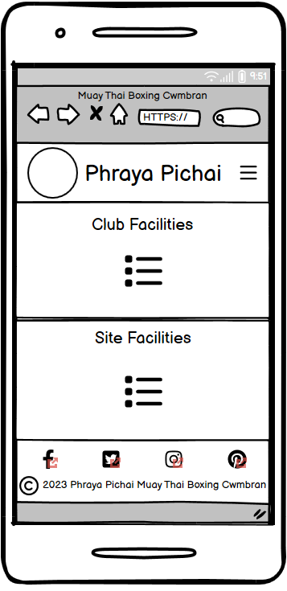 |
| Desktop | 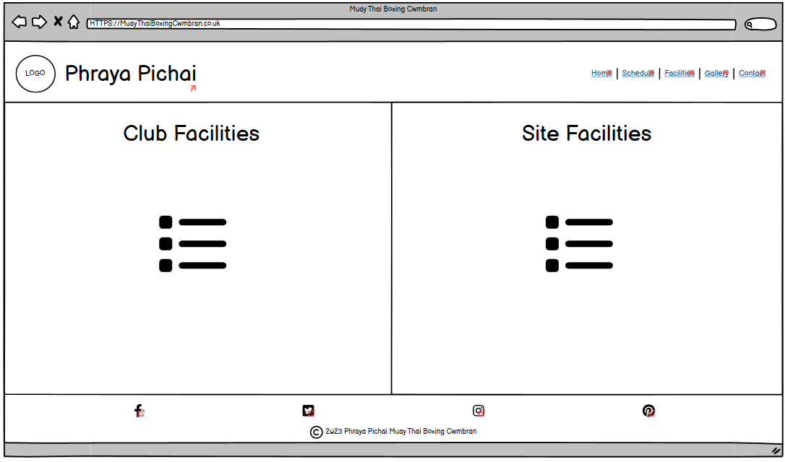 |

### Gallery Page Wireframes

| Size | Screenshot |
| --- | --- |
| Mobile |  |
| Desktop |  |

### Contact Page Wireframes

| Size | Screenshot |
| --- | --- |
| Mobile | 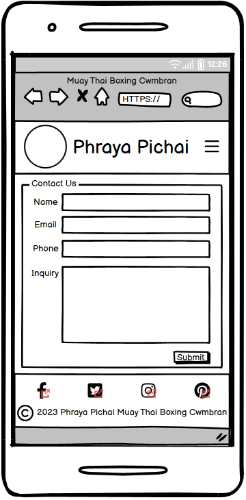 |
| Desktop |  |

### Confirmation Page Wireframes

| Size | Screenshot |
| --- | --- |
| Mobile | 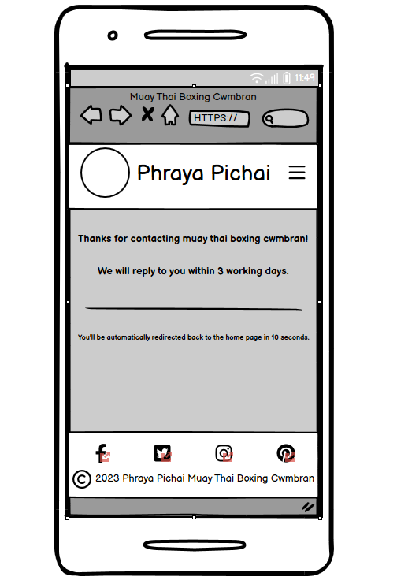 |
| Desktop | 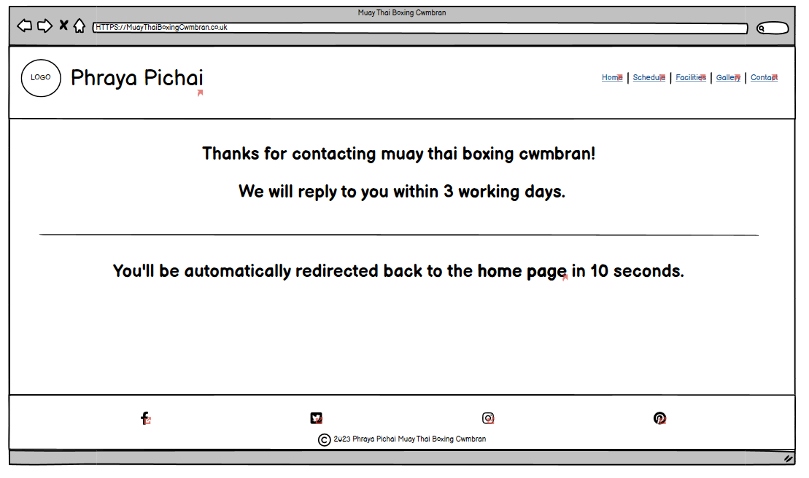 |

## Features

The website consists of the following pages:  
* Home page
* Schedule page
* Facilities page
* Gallery page
* contact page 
* confirmation page 

There will be a breakdown of each pages features in order below

### Existing Features

- **Feature #1 nav bar mobile toggler**

    - The mobile nav toggler button gives ease of use on a mobile, collapsing what would be an otherwise messy and squashed nav bar on a mobile interface. once toggled open you have the mobile navigation which is clear and user friendly to navigate the site, you can press the toggler button for the second time to close this menu without having to make a choice, finally when you hover over an element of the nav bar it gives the user clear feedback as seen in the screenshot below.

nav bar menu closed:

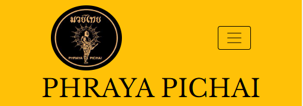  

nav bar menu open:

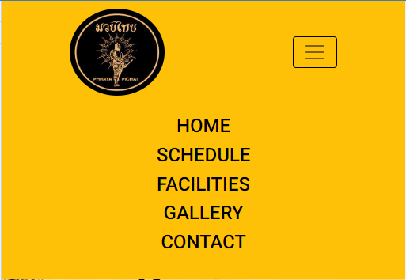

nav bar menu with hover:

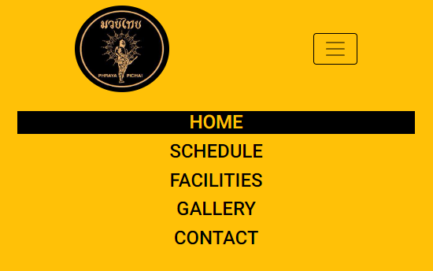

- **Feature #2 nav bar**

    - The nav bar is a helpful navigation feature displayed clearly at the top of each page to give the user easy navigation controls for the site, this benefits the site because it makes all areas easily accessible, finally when you hover over an element of the nav bar it gives the user clear feedback as seen in the screenshot below.

nav bar without mobile toggler:

  

nav bar hover feedback:

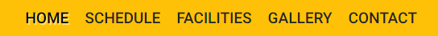

- **Feature #3 hero image and title on home page**

    - Here we have a nice hero image displaying people practicing the art of muay thai with a clear concise title making sure the user knows where they are and what the site is about benefiting the users experience and the sites usability.

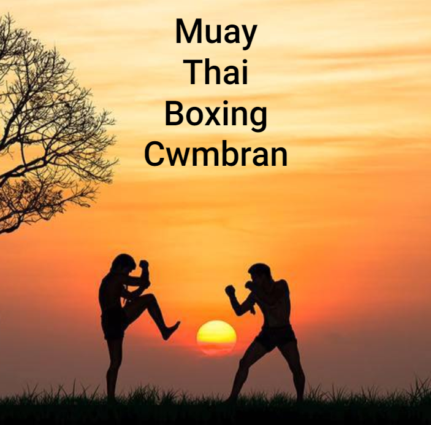

- **Feature #4 footer icons**

    - The footer icons are part of the footer which lets the user know that they have come to the end of the page, the icons themselfs are links to social medias for if they wish to connect in other ways with the camp, once the icons have been hovered over they give a feedback to let the user know that they are hovering and the site is registering their movements giving them feedback for a good user experience which also benefits the sites usability and credability.

This is the regular footer with the social icons displayed:  

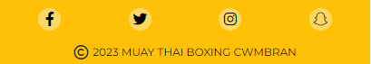  

This is the footer with the hover effect applied so you can see the feedback the user would get when they hover, the effect is applied to the facebook icon on the left:  

- **Feature #5 alert bar**

    - The alert bar pulls the users attention to the fact that the first class is free which benefits the site as it would benefit the camp because it would entice the user to use the free class to see if they like the camp, boosting numbers to the camp which in turn would boost numbers of users.

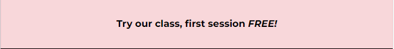

- **Feature #6 schedule**

    - The schedule cards are one of the most important features on the site right now as this will tell users when, where, what and how much the sessions are. This benefits the site as it would be one of the most used features, it would be checked by new users for initial information and checked by returning users and members for any schedule updates.

- **Feature #7 back to top chevron**

    - The back to top chevron is displayed on the schedule and gallery pages with a smooth scroll and hover effect applied to it for a good user experience, it is only on these pages due to the fact that the other pages are not long enough to make the chevron viable.  

The back to top chevron:  

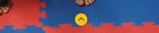  

The chevron with hover feedback:  

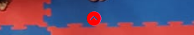

- **Feature #8 facilities list**

    - The facilites list shows the user what is available to them as part of the camp and on-site, this benefits the user for if they wish to do something after the session or if they wanted to know what is provided by the camp, it benefits the site as it should minimise the use of the contact form to free up the instructor for more teaching than answering queries that could have been answered on the site.

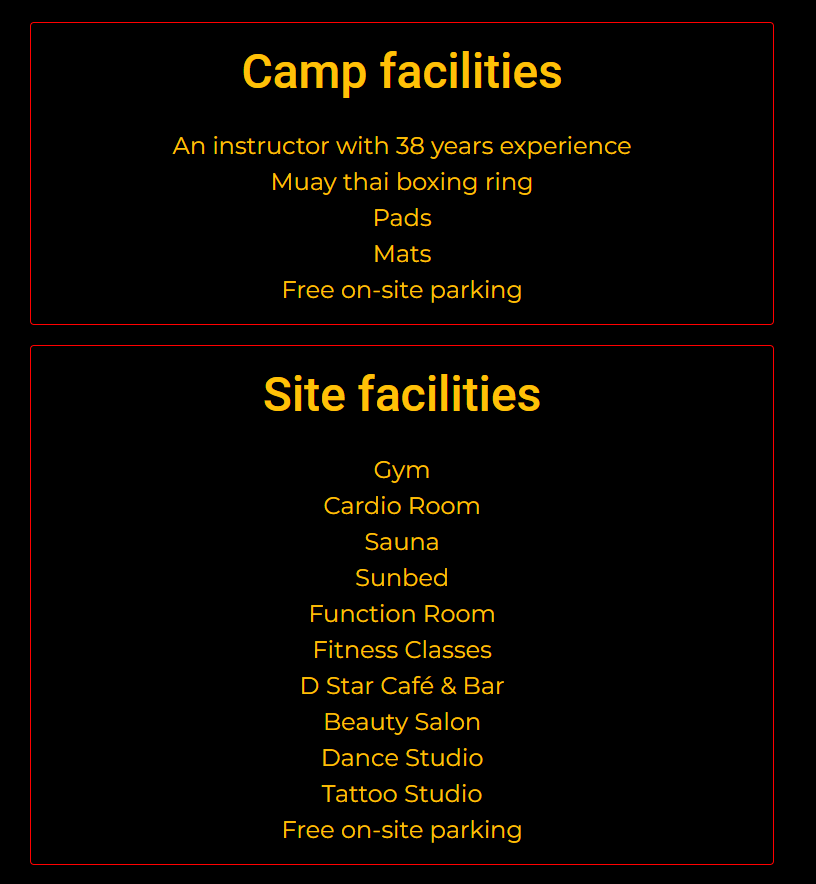

- **Feature #9 gallery sections**

    - The gallery section has image's with a caption next to them to explain what the user is looking at in the picture, this benefits the user so they can see the type of things they would be doing along with recognising faces if they decided to join the camp, it would benefit members of the camp as they could show friends and introduce others to the site from that talking point. The gallery benefits the site as an entertainment section creating retention for a short time.  

Top of the gallery:  

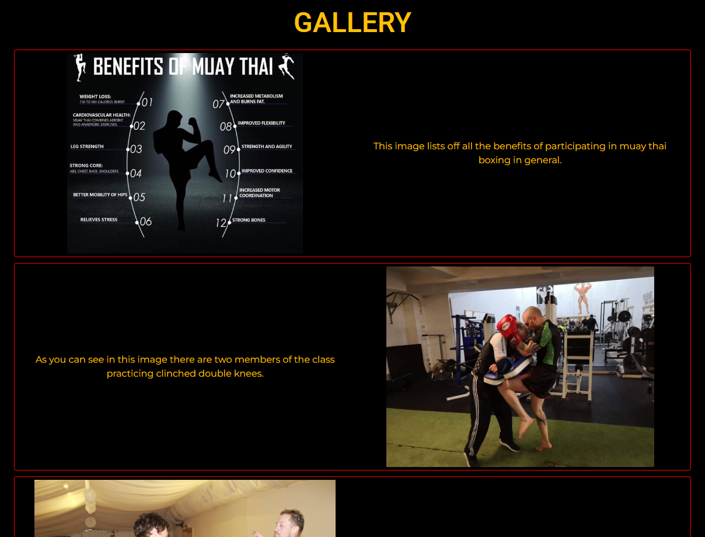  

Bottom of the gallery:  

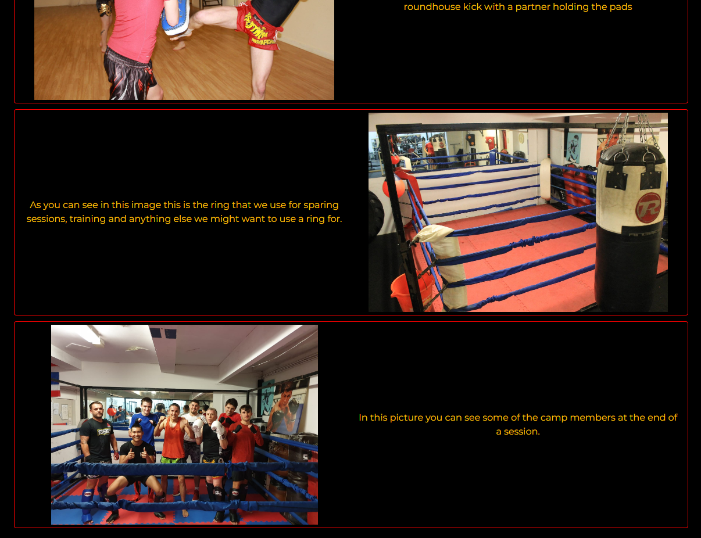

- **Feature #10 contact form**

    - On the contact form we have the contact us header as a call to action, I have set the name, email and message to required so we know who is getting in contact, a way to contact them back to answer the query and the message so there is something to answer, I did not set the phone section to required as not everyone likes to give this information out. Finally I set the submit button to give feedback on hover, this all benefits the user so they dont accidentally send the query unfinished and so they know the site is registering their movements for a good user experience, it benefits the site so there is not incomplete messages sent.  

The full contact form:  

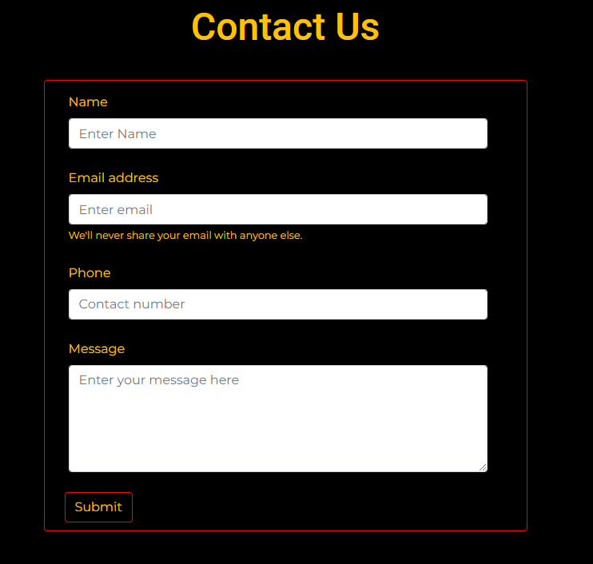  

The name required showing:  

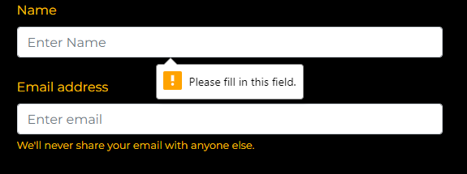  

The email required showing:  

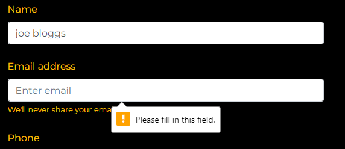  

The message required showing:  

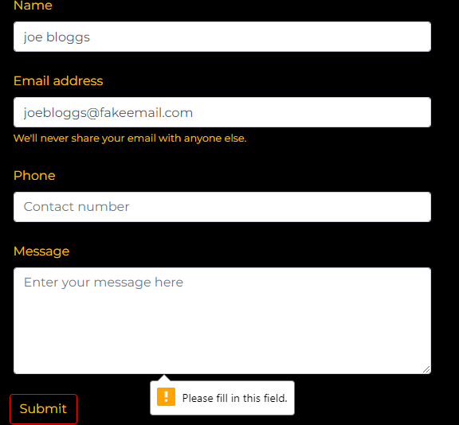  

The submit hover button:  

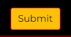  

- **Feature #11 confirmation**

    - The confirmation of submission page is a nice feature for a good user experience, letting the user know that the submission has been successful, how long is needed before they get a response and helping them get back to the main site automatically or through a link.

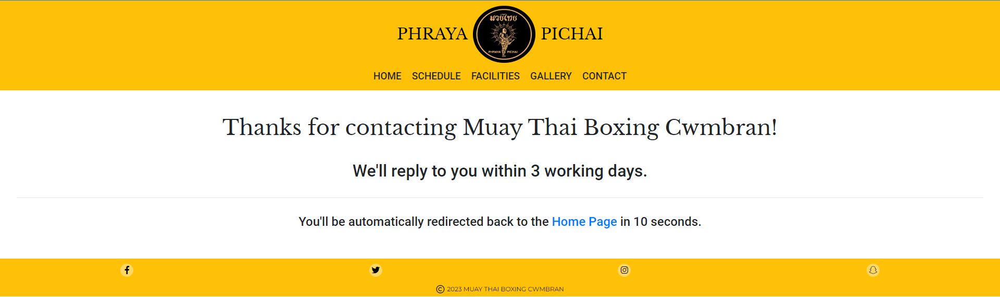  

- **Feature #12 confirmation automatic redirect**

    - The automatic redirect is a good feature for user experience again due to the message being displayed and the user not having to do anything to get back to the main site.

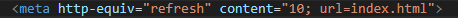

### Future Features

For future features we do have a couple if ideas that we will list below, these havent been implemented yet for a few reasons, these being:  
* viability
* lack of knowledge / skill
* keeping the site simple for release

- feature #1 a login that will unlock other areas of the site once logged in
    - If I can implement a login for current members and returning users this will cater to other future features I would like to implement, this was not implemented due to my lack of skill and knowledge in this area.  

- feature #2 a membership payment system that will track members payment for instructor and ease of payment for user.
    - If I can implement this it will make payments for classes and tracking who has and hasnt paid easier, we could also offer monthly memberships and more, this was not implemented due to my lack of skill and knowledge in this area.  

- feature #3 an About us page
    - This page will tell you about the history of the camp and past achievements like past champions and so on, this was not implemented due to trying to minimise the amount of pages for initial release to keep it a simple site at first.  

- feature #4 shop page
    - This page would allow the user to buy branded equipment like tops, gloves, shorts and more with the phraya pitchai logo, this was not implemented due to my lack of skill and knowledge in this area.  

- feature #5 chat
    - This feature would be a club specific page where they can chat and share things it would function similar to a social media group but on the official website, this was not implemented due to my lack of skill and knowledge in this area.  

- feature #6 instructional video page or video lessons
    - This page could be about any videos made pertaining to the camp or lessons that had been recorded for anyone that missed the session, this was not implemented due to trying to minimise the amount of pages for initial release to keep it a simple site at first.

- feature #7 an admin login where the instructor or chosen admins are able to upload things and change information like the schedule
    - This page could be about any videos made pertaining to the camp or lessons that had been recorded for anyone that missed the session, this was not implemented due to my lack of skill and knowledge in this area.  

- feature #8 have the number 10 count down to 0
    - This would be extra for good user experience, I have not implemented it due to me not knowing JavaScript.  

## Tools & Technologies Used

In this section, I have listed all tools and technologies used to develop the site below.

- [HTML](https://en.wikipedia.org/wiki/HTML) used for the main site content.
- [CSS](https://en.wikipedia.org/wiki/CSS) used for the main site design and layout.
- [CSS Flexbox](https://www.w3schools.com/css/css3_flexbox.asp) and [CSS Grid](https://www.w3schools.com/css/css_grid.asp) used for an enhanced responsive layout this was used in conjunction with the bootstrap classes.
- [Bootstrap](https://getbootstrap.com) used as the front-end CSS framework for modern responsiveness and pre-built components.
- [JQuery](https://jquery.com/) used for user interaction on the mobile toggler nav bar again implemented through the bootstrap framework.
- [Git](https://git-scm.com) used for version control. (`git add`, `git commit`, `git push`)
- [GitHub](https://github.com) used for secure online code storage.
- [GitHub Pages](https://pages.github.com) used for hosting the deployed front-end site.
- [Gitpod](https://gitpod.io) used as a cloud-based IDE for development.
- [Markdown Builder by Tim Nelson](https://traveltimn.github.io/markdown-builder/) used to help generate the Markdown files.

## Testing

For all testing, please refer to the [TESTING.md](TESTING.md) file.

## Deployment

The site was deployed to GitHub Pages. The steps to deploy are as follows:
- In the [GitHub repository](https://github.com/Nap199I/Muay-thai-boxing-Cwmbran), navigate to the Settings tab 
- From the source section drop-down menu, select the **Main** Branch, then click "Save".
- The page will be automatically refreshed with a detailed ribbon display to indicate the successful deployment.

The live link can be found [here](https://nap199i.github.io/Muay-thai-boxing-Cwmbran)

### Local Deployment

This project can be cloned or forked in order to make a local copy on your own system.

#### Cloning

You can clone the repository by following these steps:

1. Go to the [GitHub repository](https://github.com/Nap199I/Muay-thai-boxing-Cwmbran) 
2. Locate the Code button above the list of files and click it 
3. Select if you prefer to clone using HTTPS, SSH, or GitHub CLI and click the copy button to copy the URL to your clipboard
4. Open Git Bash or Terminal
5. Change the current working directory to the one where you want the cloned directory
6. In your IDE Terminal, type the following command to clone my repository:
	- `git clone https://github.com/Nap199I/Muay-thai-boxing-Cwmbran.git`
7. Press Enter to create your local clone.

Alternatively, if using Gitpod, you can click below to create your own workspace using this repository.

Please note that in order to directly open the project in Gitpod, you need to have the browser extension installed.
A tutorial on how to do that can be found [here](https://www.gitpod.io/docs/configure/user-settings/browser-extension).

#### Forking

By forking the GitHub Repository, we make a copy of the original repository on our GitHub account to view and/or make changes without affecting the original owner's repository.
You can fork this repository by using the following steps:

1. Log in to GitHub and locate the [GitHub Repository](https://github.com/Nap199I/Muay-thai-boxing-Cwmbran)
2. At the top of the Repository (not top of page) just above the "Settings" Button on the menu, locate the "Fork" Button.
3. Once clicked, you should now have a copy of the original repository in your own GitHub account!

### Local VS Deployment

Use this space to discuss any differences between the local version you've developed, and the live deployment site on GitHub Pages.

## Credits

Below is where I will give mention to people that have helped me throughout my project, given me ideas to implement and supported me throughout the process, a massive thanks to all, without the support I received the project would have been vastly different and i am very greatful.

### Content

In this table I will be giving credit for any code snippets, elements or resources used throughout the website.

| Source | Location | Notes |
| --- | --- | --- |
| [Markdown Builder by Tim Nelson](https://traveltimn.github.io/markdown-builder/) | README and TESTING | tool to help generate the Markdown files |
| [bootstrap](https://getbootstrap.com/docs/4.3/components/navbar/#external-content) | entire site | mobile toggler dropdown bar |
| [bootstrap](https://getbootstrap.com/docs/4.3/getting-started/introduction/) | entire site | provided classes to help style the site through css |
| [bootstrap](https://getbootstrap.com/docs/4.3/components/alerts/) | schedule page | used code snippet for the alert box |
| [Font Awesome](https://fontawesome.com/icons/circle-chevron-up?s=solid&f=classic) | schedule and gallery pages | used for the back to top chevron |
| [Font Awesome](https://fontawesome.com/search?q=facebook&o=r) | entire site | the external facebook link in the footer |
| [Font Awesome](https://fontawesome.com/search?q=twitter&o=r) | entire site | the external twitter link in the footer |
| [Font Awesome](https://fontawesome.com/search?q=instagram&o=r) | entire site | the external instagram link in the footer |
| [Font Awesome](https://fontawesome.com/search?q=snapchat&o=r) | entire site | the external snapchat link in the footer |
| [W3Schools](https://www.w3schools.com) | entire site | used as a referance for understanding and a guiding hand |
| [Flexbox Froggy](https://flexboxfroggy.com/) | entire site | Taught me flexbox which helped with the layout of the site |
| [StackOverflow](https://stackoverflow.com/) | entire site | helped provide answers when troubleshooting |

### Media

I will show here where I got my media files from that I used in the site, when i spoke to the instructor about using the images from the facebook page and group he said it was ok to do so leading me to believe I have permission to use the images.

| Source | Location | Type | Notes |
| --- | --- | --- | --- |
| [Cwmbran Muay Thai facebook group](https://www.facebook.com/photo/?fbid=2060795744151198&set=g.473075406411362) | Home page | image | The main hero image |
| [Phraya Pitchai Cwmbran Muay Thai Club facebook page](https://www.facebook.com/photo.php?fbid=495406978945062&set=pb.100054272929870.-2207520000.&type=3) | entire site | image | Logo in the nav bar |
| [Phraya Pitchai Cwmbran Muay Thai Club facebook page](https://www.facebook.com/Muaythaicwmbran/photos/pb.100054272929870.-2207520000./2359989974231772/?type=3) | gallery page | image | benefits image in the gallery |
| [Phraya Pitchai Cwmbran Muay Thai Club facebook page](https://www.facebook.com/Muaythaicwmbran/photos/pb.100054272929870.-2207520000./2511383185759116/?type=3) | schedule and gallery pages | image | background image for schedule page and an image within the gallery page |
| [Phraya Pitchai Cwmbran Muay Thai Club facebook page](https://www.facebook.com/Muaythaicwmbran/photos/pb.100054272929870.-2207520000./2417894805107955/?type=3) | gallery page | image | knees image in the gallery |
| [Phraya Pitchai Cwmbran Muay Thai Club facebook page](https://www.facebook.com/Muaythaicwmbran/photos/pb.100054272929870.-2207520000./2404361989794570/?type=3) | gallery page | image | ring image in the gallery |
| [Phraya Pitchai Cwmbran Muay Thai Club facebook page](https://www.facebook.com/Muaythaicwmbran/photos/pb.100054272929870.-2207520000./2404361349794634/?type=3) | gallery page | image | roundhouse image in the gallery |

### Acknowledgements

In this space I will be providing attribution to any supports that helped, encouraged, or supported me throughout the development stages of this project.

- I would like to thank my Code Institute mentor, [Tim Nelson](https://github.com/TravelTimN) for his valuable time and support throughout the development of this project.
- I would like to thank the [Code Institute](https://codeinstitute.net) tutor team for their availability for assistance with troubleshooting and debugging with project issues.
- I would like to thank [Ant_4P](https://app.slack.com/client/T0L30B202/D04NTQKBEV6/rimeto_profile/U04F83YAH32) for giving me the idea to use text shadow for feedback on the nav bar.
- I would like to thank my wife (Sara), for believing in me, and supporting me to make this transition into software development.
- I would like to thank my class lead [Iris smok](https://www.linkedin.com/in/irissmok/), for sharing all the great knowledge, tips and tricks and advice that you have in the stand up sessions.
