# MUAY THAI BOXING CWMBRAN

This project idea muay thai boxing cwmbran came about as i wanted to build a real world site for my project instead of something made up, i used to be a part of this thai boxing camp and was quite close with the instructor so i reached out to him and asked him if he wanted me to build the club a website, the main reason for building the site was to have all the information, most importantly the schedule all in one place.

Muay thai boxing cwmbran hopes that it will give users all they need to join the club and find all the information necessary, it also aims to update current members on any schedule changes and at a later date an easier way to pay and monitor memberships.  
The intended audience for this project are as follows:

* Parents
* People that want to fight in competitions
* People that want to learn self defence
* People that want to improve fitness or mental health
* Someone looking for a hobby to pursue 
* Members of the camp  

This site benefits this demographic as it gives you all the information you need to join, updates on the schedule and an overview of the facilities available on-site.

  
Here's the am i responsive site as an example:
https://ui.dev/amiresponsive?url=https://nap199i.github.io/Muay-thai-boxing-Cwmbran

## UX

My UX process was to go through a microsoft document that i made, it took me through the five planes of UX. I also had a meeting with the client (my old instructor) to see what was important to him to be included into the site, what his goal for the site was I.E who he wanted to use it, what the purpose of the site was, the color schemes, pages for the initial release and things we wanted to add in later releases.

### Colour Scheme

The color scheme used was yellow, black and red. These are camp colors and itemised below.

- `#ffc107` used for primary text, content titles, nav bar background and mobile menu text hover effect.
- `#ff0000` used for main content boarders and hover colors for social icons.
- `#000000` used for main content backgrounds where images were not used, nav bar headings and mobile menu background hover effect.
- `#ffdd79` used for text shadow on nav bar.


Consider adding a link and screenshot for your colour scheme using "coolors".
https://coolors.co/generate

When you add a colour to the palette, the URL is dynamically updated, making it easier for you to return back to your colour palette later if needed.

Example:

I used [coolors.co](https://coolors.co/ffc107-000000-ff0000-ffdd79) to generate my colour palette.

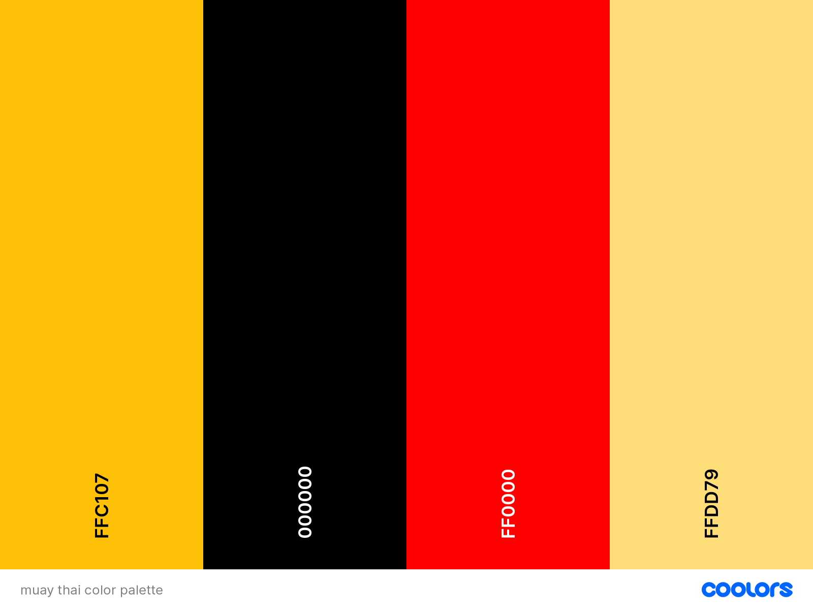

The `:root` variables used in this project were imported by bootstrap.

```css
:root {
    --blue: #007bff;
    --indigo: #6610f2;
    --purple: #6f42c1;
    --pink: #e83e8c;
    --red: #dc3545;
    --orange: #fd7e14;
    --yellow: #ffc107;
    --green: #28a745;
    --teal: #20c997;
    --cyan: #17a2b8;
    --white: #fff;
    --gray: #6c757d;
    --gray-dark: #343a40;
    --primary: #007bff;
    --secondary: #6c757d;
    --success: #28a745;
    --info: #17a2b8;
    --warning: #ffc107;
    --danger: #dc3545;
    --light: #f8f9fa;
    --dark: #343a40;
    --breakpoint-xs: 0;
    --breakpoint-sm: 576px;
    --breakpoint-md: 768px;
    --breakpoint-lg: 992px;
    --breakpoint-xl: 1200px;
    --font-family-sans-serif: -apple-system,BlinkMacSystemFont,"Segoe UI",Roboto,"Helvetica Neue",Arial,sans-serif,"Apple Color Emoji","Segoe UI Emoji","Segoe UI Symbol","Noto Color Emoji";
    --font-family-monospace: SFMono-Regular,Menlo,Monaco,Consolas,"Liberation Mono","Courier New",monospace;
}
```

### Typography

The reason i picked these fonts were for a professional and clean look to the site.

- [Libre Baskerville](https://fonts.google.com/specimen/Libre+Baskerville?query=libre) was used for the main nav titles.

- [Roboto](https://fonts.google.com/specimen/Roboto?query=robo) was used for the primary headers and titles.

- [Montserrat](https://fonts.google.com/specimen/Montserrat) was used for the primary text throughout the site.

- [Font Awesome](https://fontawesome.com) icons were used throughout the site, such as the social media icons in the footer and back to top chevrons.

## User Stories

To help with this section, when i had the meeting with my client we discussed site admin goals and different user goals which has been shown below.

### New Site Users

- As a new site user, I would like to find out the location, so that I can join the camp .
- As a new site user, I would like to find out the schedule, so that I can join the camp.
- As a new site user, I would like to contact the camp administration, so that I can ask any questions I may have.
- As a new site user, I would like to find the price of the sessions, so that I can pay the correct amount when I join.
- As a new site user, I would like to find information on the sessions, so that I can pick which ones to attend.

### Returning Site Users

- As a returning site user, I would like to find the schedule, so that I can make sure there has been no changes.
- As a returning site user, I would like to look at the gallery, so that I can show people my friends and what I am a part of.
- As a returning site user, I would like to use the contact section, so that I can inform the instructor that I wont be able to make a session.

### Site Admin

- As a site administrator, I should be able to have our information displayed, so that I can update new and existing members on times, locations and prices.
- As a site administrator, I should be able to have images on the site, so that I can so potential new recruits can see what we do or so existing members can show friends.
- As a site administrator, I should be able to recieve and answer queries by email, so that I can assist anyone looking to join or any existing members issues.

## Wireframes

I've used [Balsamiq](https://balsamiq.com/wireframes) to design my site wireframes.

### Home Page Wireframes

| Size | Screenshot |
| --- | --- |
| Mobile |  |
| Desktop |  |

### Schedule Page Wireframes

| Size | Screenshot |
| --- | --- |
| Mobile |  |
| Desktop | 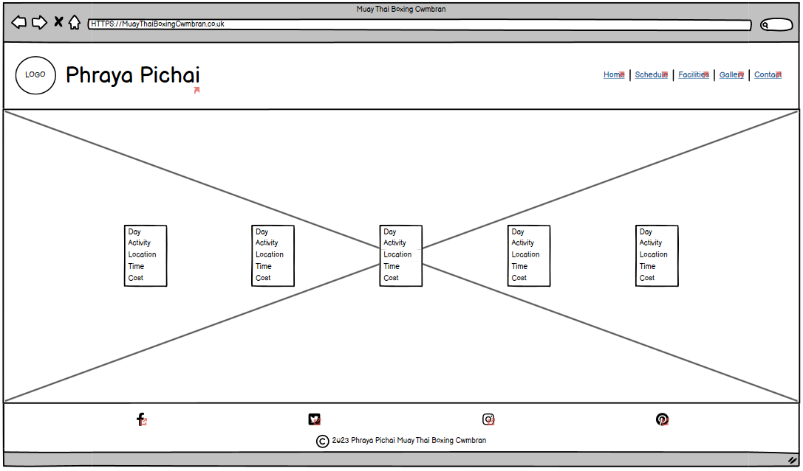 |

### Facilities Page Wireframes

| Size | Screenshot |
| --- | --- |
| Mobile |  |
| Desktop | 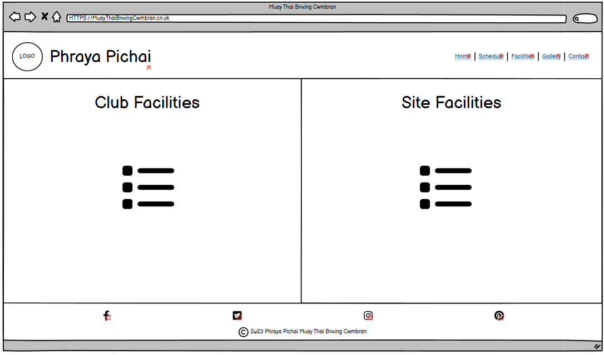 |

### Gallery Page Wireframes

| Size | Screenshot |
| --- | --- |
| Mobile | 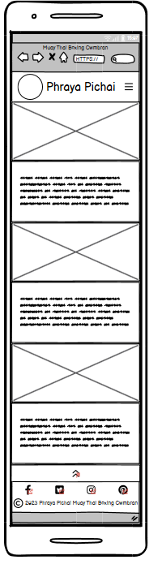 |
| Desktop | 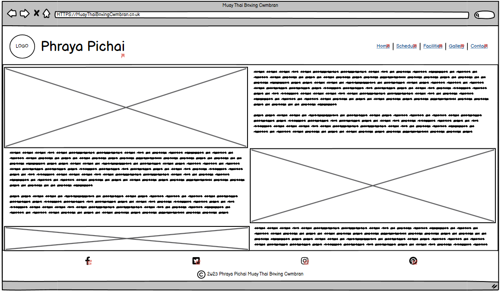 |

### Contact Page Wireframes

| Size | Screenshot |
| --- | --- |
| Mobile | 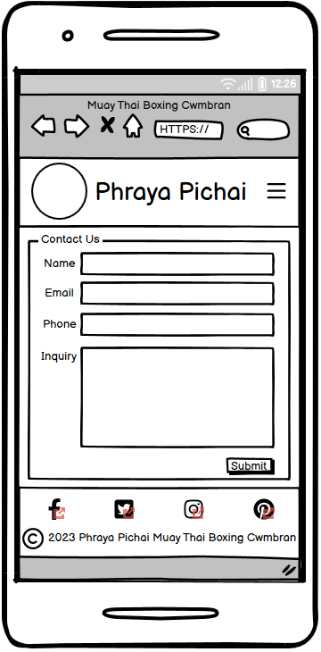 |
| Desktop | 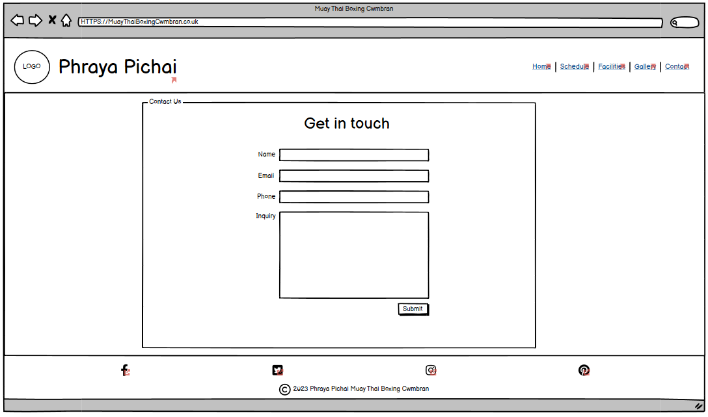 |

## Features

The website consists of the following pages:  
* Home page
* Schedule page
* Facilities page
* Gallery page
* contact page  

There will be a breakdown of each pages features in order below

### Existing Features

- **Feature #1 nav bar mobile toggler**

    - The mobile nav toggler button gives ease of use on a mobile, collapsing what would be an otherwise messy and squashed nav bar on a mobile interface. once toggled open you have the mobile navigation which is clear and user friendly to navigate the site, you can press the toggler button for the second time to close this menu without having to make a choice, finally when you hover over an element of the nav bar it gives the user clear feedback as seen in the screenshot below.

nav bar menu closed:

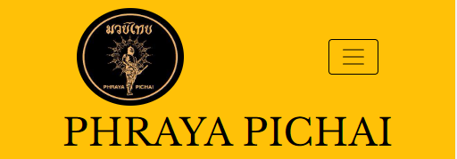  

nav bar menu open:

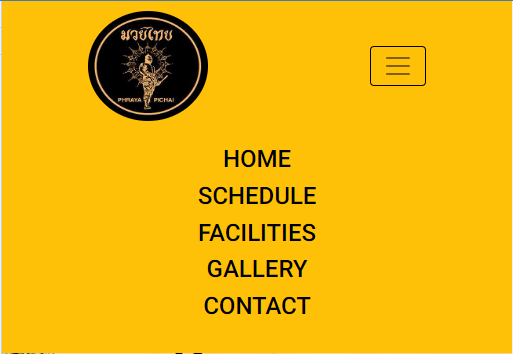

nav bar menu with hover:

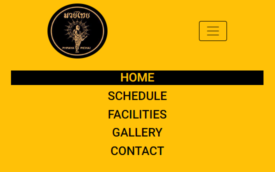

- **Feature #2 nav bar**

    - The nav bar is a helpful navigation feature displayed clearly at the top of each page to give the user easy navigation controls for the site, this benefits the site because it makes all areas easily accessible, finally when you hover over an element of the nav bar it gives the user clear feedback as seen in the screenshot below.

nav bar without mobile toggler:

  

nav bar hover feedback:

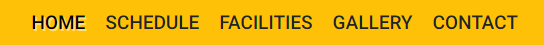

- **Feature #3 hero image and title on home page**

    - Here we have a nice hero image displaying people practicing the art of muay thai with a clear concise title making sure the user knows where they are and what the site is about benefiting the users experience and the sites usability.


- **Feature #4 footer icons**

    - The footer icons are part of the footer which lets the user know that they have come to the end of the page, the icons themselfs are links to social medias for if they wish to connect in other ways with the camp, once the icons have been hovered over they give a feedback to let the user know that they are hovering and the site is registering their movements giving them feedback for a good user experience which also benefits the sites usability and credability.

This is the regular footer with the social icons displayed:  

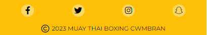  

This is the footer with the hover effect applied so you can see the feedback the user would get when they hover, the effect is applied to the facebook icon on the left:  

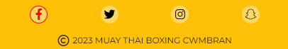

- **Feature #5 alert bar**

    - The alert bar pulls the users attention to the fact that the first class is free which benefits the site as it would benefit the camp because it would entice the user to use the free class to see if they like the camp, boosting numbers to the camp which in turn would boost numbers of users.

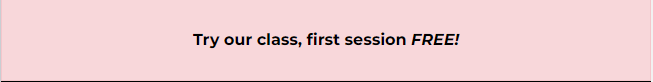

- **Feature #6 schedule**

    - The schedule cards are one of the most important features on the site right now as this will tell users when, where, what and how much the sessions are. This benefits the site as it would be one of the most used features, it would be checked by new users for initial information and checked by returning users and members for any schedule updates.

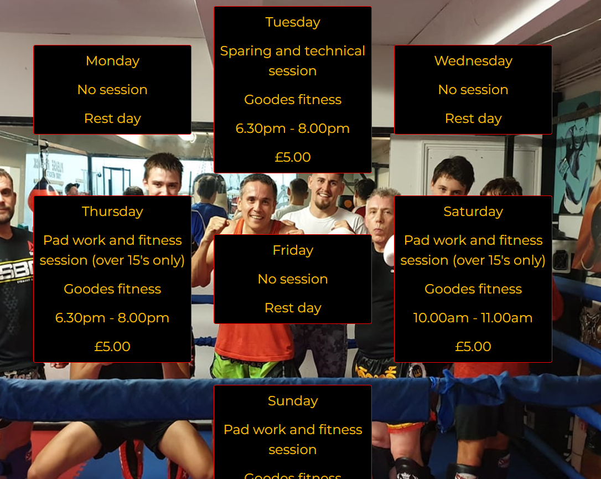

- **Feature #7 back to top chevron**

    - The back to top chevron is displayed on the schedule and gallery pages with a smooth scroll and hover effect applied to it for a good user experience, it is only on these pages due to the fact that the other pages are not long enough to make the chevron viable.  

The back to top chevron:  

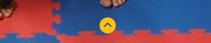  

The chevron with hover feedback:  

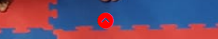

- **Feature #8 facilities list**

    - The facilites list shows the user what is available to them as part of the camp and on-site, this benefits the user for if they wish to do something after the session or if they wanted to know what is provided by the camp, it benefits the site as it should minimise the use of the contact form to free up the instructor for more teaching than answering queries that could have been answered on the site.

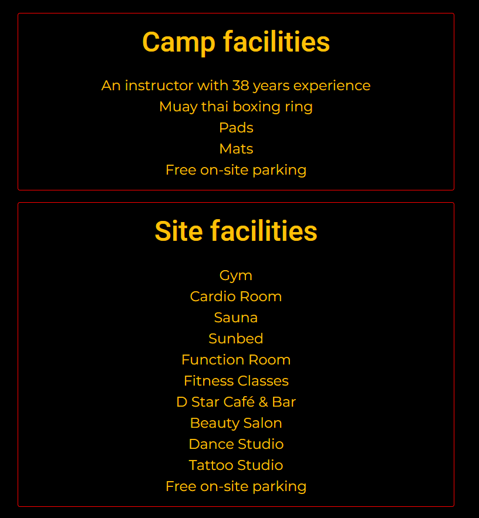

- **Feature #9 gallery sections**

    - The gallery section has image's with a caption next to them to explain what the user is looking at in the picture, this benefits the user so they can see the type of things they would be doing along with recognising faces if they decided to join the camp, it would benefit members of the camp as they could show friends and introduce others to the site from that talking point. The gallery benefits the site as an entertainment section creating retention for a short time.  

Top of the gallery:  

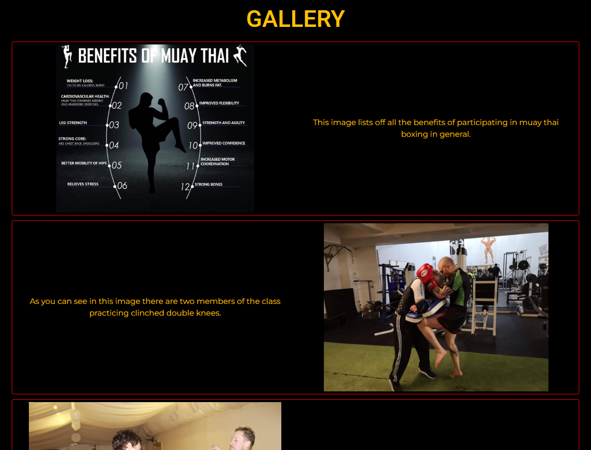  

Bottom of the gallery:  

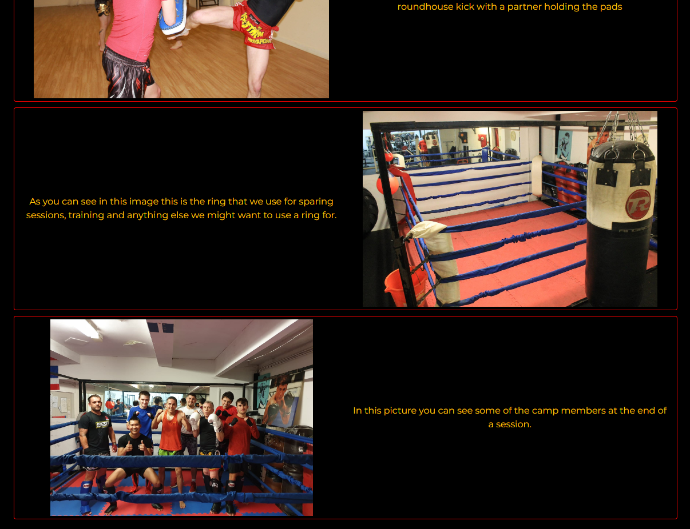

- **Feature #10 contact form**

    - On the contact form we have the contact us header as a call to action, I have set the name, email and message to required so we know who is getting in contact, a way to contact them back to answer the query and the message so there is something to answer, I did not set the phone section to required as not everyone likes to give this information out. Finally I set the submit button to give feedback on hover, this all benefits the user so they dont accidentally send the query unfinished and so they know the site is registering their movements for a good user experience, it benefits the site so there is not incomplete messages sent.  

The full contact form:  

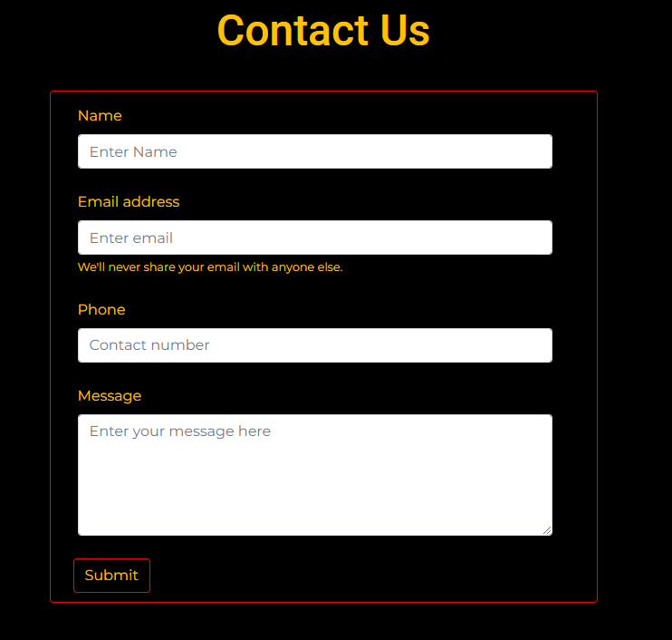  

The name required showing:  

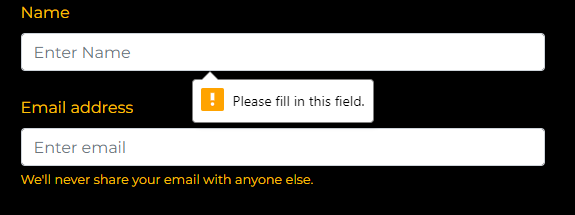  

The email required showing:  

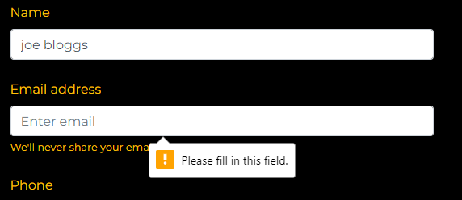  

The message required showing:  

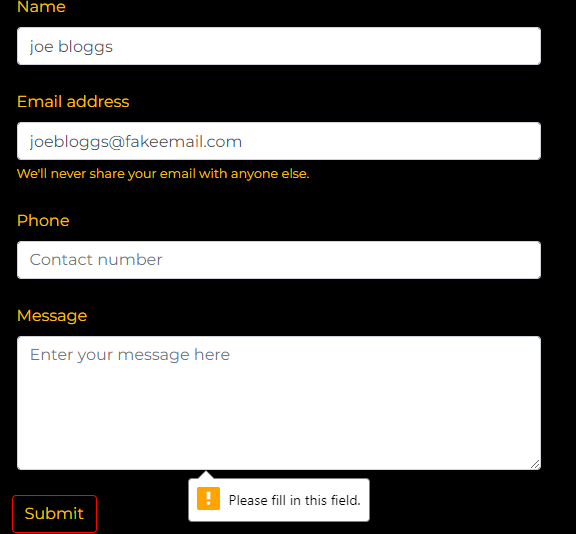  

The submit hover button:  

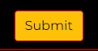

### Future Features

Do you have additional ideas that you'd like to include on your project in the future?
Fantastic! List them here!
It's always great to have plans for future improvements!
Consider adding any helpful links or notes to help remind you in the future, if you revisit the project in a couple years.

- Cool new feature #1
    - Any additional notes about this feature.
- Cool new feature #2
    - Any additional notes about this feature.
- Cool new feature #3
    - Any additional notes about this feature.

## Tools & Technologies Used

In this section, you should explain the various tools and technologies used to develop the project.
Make sure to put a link (where applicable) to the source, and explain what each was used for.
Some examples have been provided, but this is just a sample only, your project might've used others.
Feel free to delete any unused items below as necessary.

- [HTML](https://en.wikipedia.org/wiki/HTML) used for the main site content.
- [CSS](https://en.wikipedia.org/wiki/CSS) used for the main site design and layout.
- [CSS :root variables](https://www.w3schools.com/css/css3_variables.asp) used for reusable styles throughout the site.
- [CSS Flexbox](https://www.w3schools.com/css/css3_flexbox.asp) and/or [CSS Grid](https://www.w3schools.com/css/css_grid.asp) used for an enhanced responsive layout.
- [Bootstrap](https://getbootstrap.com) used as the front-end CSS framework for modern responsiveness and pre-built components.
- [Materialize](https://materializecss.com) used as the front-end CSS framework for modern responsiveness and pre-built components.
- [JavaScript](https://www.javascript.com) used for user interaction on the site.
- [Python](https://www.python.org) used as the back-end programming language.
- [Git](https://git-scm.com) used for version control. (`git add`, `git commit`, `git push`)
- [GitHub](https://github.com) used for secure online code storage.
- [GitHub Pages](https://pages.github.com) used for hosting the deployed front-end site.
- [Gitpod](https://gitpod.io) used as a cloud-based IDE for development.
- [Markdown Builder by Tim Nelson](https://traveltimn.github.io/readme-builder) used to help generate the Markdown files.
- [Flask](https://flask.palletsprojects.com) used as the Python framework for the site.
- [Django](https://www.djangoproject.com) used as the Python framework for the site.
- [MongoDB](https://www.mongodb.com) used as the non-relational database management with Flask.
- [SQLAlchemy](https://www.sqlalchemy.org) used as the relational database management with Flask.
- [PostgreSQL](https://www.postgresql.org) used as the relational database management.
- [ElephantSQL](https://www.elephantsql.com) used as the Postgres database.
- [Heroku](https://www.heroku.com) used for hosting the deployed back-end site.
- [Cloudinary](https://cloudinary.com) used for online static file storage.
- [Stripe](https://stripe.com) used for online secure payments of ecommerce products/services.
- [AWS S3](https://aws.amazon.com/s3) used for online static file storage.

## Testing

For all testing, please refer to the [TESTING.md](testing.md) file.

## Deployment

The site was deployed to GitHub Pages. The steps to deploy are as follows:
- In the [GitHub repository](https://github.com/Nap199I/Muay-thai-boxing-Cwmbran), navigate to the Settings tab 
- From the source section drop-down menu, select the **Main** Branch, then click "Save".
- The page will be automatically refreshed with a detailed ribbon display to indicate the successful deployment.

The live link can be found [here](https://nap199i.github.io/Muay-thai-boxing-Cwmbran)

### Local Deployment

This project can be cloned or forked in order to make a local copy on your own system.

#### Cloning

You can clone the repository by following these steps:

1. Go to the [GitHub repository](https://github.com/Nap199I/Muay-thai-boxing-Cwmbran) 
2. Locate the Code button above the list of files and click it 
3. Select if you prefer to clone using HTTPS, SSH, or GitHub CLI and click the copy button to copy the URL to your clipboard
4. Open Git Bash or Terminal
5. Change the current working directory to the one where you want the cloned directory
6. In your IDE Terminal, type the following command to clone my repository:
	- `git clone https://github.com/Nap199I/Muay-thai-boxing-Cwmbran.git`
7. Press Enter to create your local clone.

Alternatively, if using Gitpod, you can click below to create your own workspace using this repository.

[](https://gitpod.io/#https://github.com/Nap199I/Muay-thai-boxing-Cwmbran)

Please note that in order to directly open the project in Gitpod, you need to have the browser extension installed.
A tutorial on how to do that can be found [here](https://www.gitpod.io/docs/configure/user-settings/browser-extension).

#### Forking

By forking the GitHub Repository, we make a copy of the original repository on our GitHub account to view and/or make changes without affecting the original owner's repository.
You can fork this repository by using the following steps:

1. Log in to GitHub and locate the [GitHub Repository](https://github.com/Nap199I/Muay-thai-boxing-Cwmbran)
2. At the top of the Repository (not top of page) just above the "Settings" Button on the menu, locate the "Fork" Button.
3. Once clicked, you should now have a copy of the original repository in your own GitHub account!

### Local VS Deployment

Use this space to discuss any differences between the local version you've developed, and the live deployment site on GitHub Pages.

## Credits

In this section you need to reference where you got your content, media, and extra help from.
It is common practice to use code from other repositories and tutorials,
however, it is important to be very specific about these sources to avoid plagiarism.

### Content

Use this space to provide attribution links to any borrowed code snippets, elements, or resources.
A few examples have been provided below to give you some ideas.

Ideally, you should provide an actual link to every resource used, not just a generic link to the main site!

| Source | Location | Notes |
| --- | --- | --- |
| [Markdown Builder by Tim Nelson](https://traveltimn.github.io/readme-builder) | README and TESTING | tool to help generate the Markdown files |
| [Chris Beams](https://chris.beams.io/posts/git-commit) | version control | "How to Write a Git Commit Message" |
| [W3Schools](https://www.w3schools.com/howto/howto_js_topnav_responsive.asp) | entire site | responsive HTML/CSS/JS navbar |
| [W3Schools](https://www.w3schools.com/howto/howto_css_modals.asp) | contact page | interactive pop-up (modal) |
| [W3Schools](https://www.w3schools.com/css/css3_variables.asp) | entire site | how to use CSS :root variables |
| [Flexbox Froggy](https://flexboxfroggy.com/) | entire site | modern responsive layouts |
| [Grid Garden](https://cssgridgarden.com) | entire site | modern responsive layouts |
| [StackOverflow](https://stackoverflow.com/a/2450976) | quiz page | Fisher-Yates/Knuth shuffle in JS |
| [YouTube](https://www.youtube.com/watch?v=YL1F4dCUlLc) | leaderboard | using `localStorage()` in JS for high scores |
| [YouTube](https://www.youtube.com/watch?v=u51Zjlnui4Y) | PP3 terminal | tutorial for adding color to the Python terminal |
| [strftime](https://strftime.org) | CRUD functionality | helpful tool to format date/time from string |
| [WhiteNoise](http://whitenoise.evans.io) | entire site | hosting static files on Heroku temporarily |

### Media

Use this space to provide attribution links to any images, videos, or audio files borrowed from online.
A few examples have been provided below to give you some ideas.

If you're the owner (or a close acquaintance) of all media files, then make sure to specify this.
Let the assessors know that you have explicit rights to use the media files within your project.

Ideally, you should provide an actual link to every media file used, not just a generic link to the main site!
The list below is by no means exhaustive. Within the Code Institute Slack community, you can find more "free media" links
by sending yourself the following command: `!freemedia`.

| Source | Location | Type | Notes |
| --- | --- | --- | --- |
| [Pexels](https://www.pexels.com) | entire site | image | favicon on all pages |
| [Lorem Picsum](https://picsum.photos) | home page | image | hero image background |
| [Unsplash](https://unsplash.com) | product page | image | sample of fake products |
| [Pixabay](https://pixabay.com) | gallery page | image | group of photos for gallery |
| [Wallhere](https://wallhere.com) | footer | image | background wallpaper image in the footer |
| [This Person Does Not Exist](https://thispersondoesnotexist.com) | testimonials | image | headshots of fake testimonial images |
| [Audio Micro](https://www.audiomicro.com/free-sound-effects) | game page | audio | free audio files to generate the game sounds |
| [Videvo](https://www.videvo.net/) | home page | video | background video on the hero section |
| [TinyPNG](https://tinypng.com) | entire site | image | tool for image compression |

### Acknowledgements

Use this space to provide attribution to any supports that helped, encouraged, or supported you throughout the development stages of this project.
A few examples have been provided below to give you some ideas.

- I would like to thank my Code Institute mentor, [John/Jane Doe](https://github.com/username) for their support throughout the development of this project.
- I would like to thank the [Code Institute](https://codeinstitute.net) tutor team for their assistance with troubleshooting and debugging some project issues.
- I would like to thank the [Code Institute Slack community](https://code-institute-room.slack.com) for the moral support; it kept me going during periods of self doubt and imposter syndrome.
- I would like to thank my spouse/partner (John/Jane), for believing in me, and allowing me to make this transition into software development.
- I would like to thank my employer, for supporting me in my career development change towards becoming a software developer.
