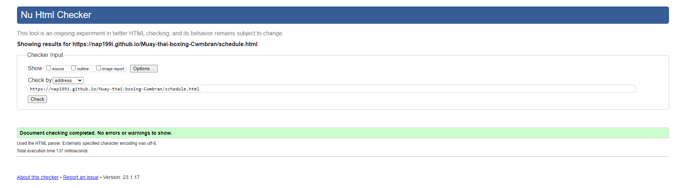
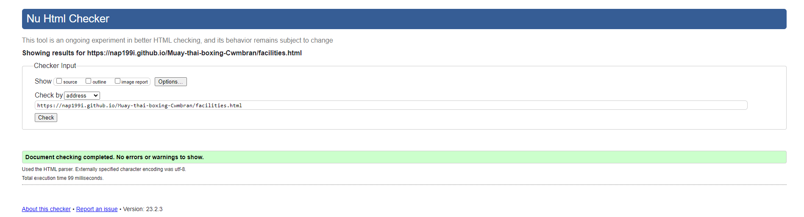
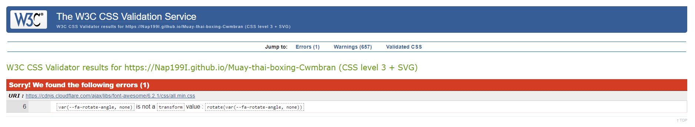
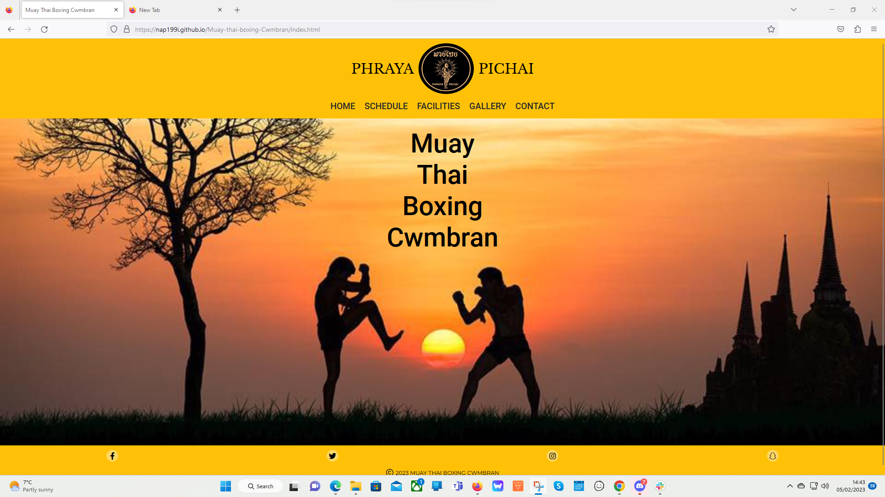
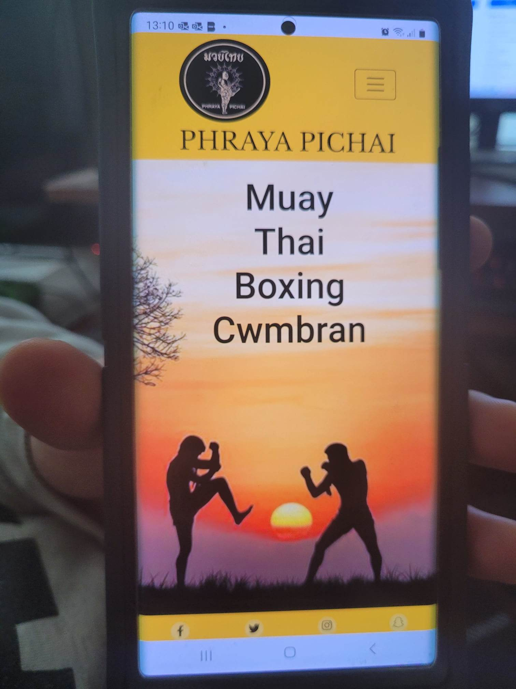
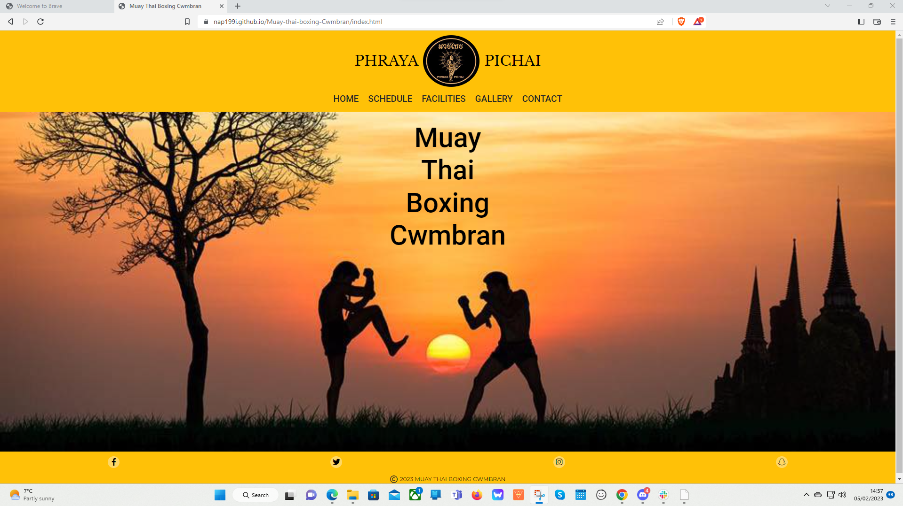
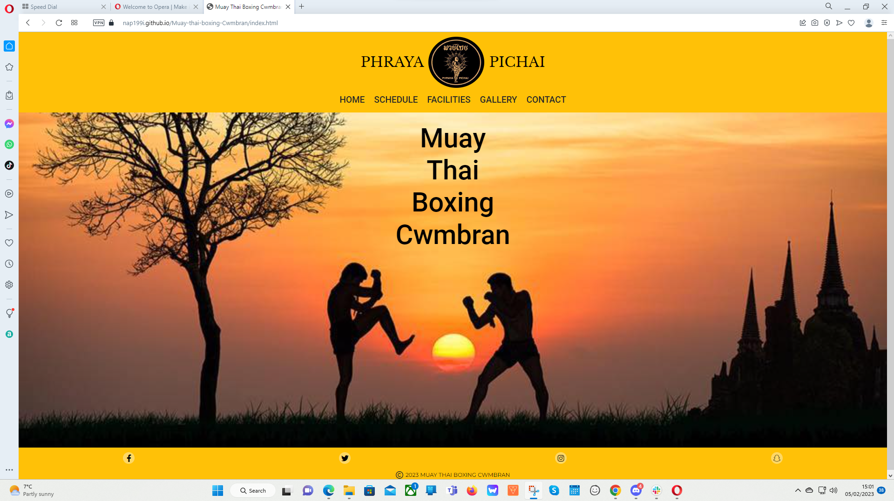
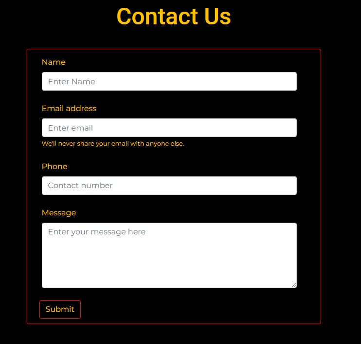

# Testing

Return back to the [README.md](README.md) file.

In this section I will be showing that I have conducted enough testing to legitimately believe that the site works well.
Essentially, in this part, I will be going over all of my project's features to ensure that they all work as intended,
with the project providing an easy and straightforward way for the users to achieve their goals.

## Code Validation

I will use this space to discuss code validation for all of my own code files (where applicable).
I will not validate external libraries/frameworks, such as imported Bootstrap, Font Awesome, etc.

### HTML

I have used the recommended [HTML W3C Validator](https://validator.w3.org) to validate all of my HTML files.

I validated the live pages (each of them) using the deployed URL.
This will give me a custom URL as well, which I will use on my testing documentation.
It makes it easier to return back to a page to validate it again in the future.

| Page | W3C URL | Screenshot | Notes |
| --- | --- | --- | --- |
| Home | [W3C](https://validator.w3.org/nu/?doc=https%3A%2F%2FNap199I.github.io%2FMuay-thai-boxing-Cwmbran%2Findex.html) |  | Pass: No Errors |
| Contact | [W3C](https://validator.w3.org/nu/?doc=https%3A%2F%2FNap199I.github.io%2FMuay-thai-boxing-Cwmbran%2Fcontact.html) |  | Pass: No Errors |
| Schedule | [W3C](https://validator.w3.org/nu/?doc=https%3A%2F%2Fnap199i.github.io%2FMuay-thai-boxing-Cwmbran%2Fschedule.html) |  | Pass: No Errors |
| Facilities | [W3C](https://validator.w3.org/nu/?doc=https%3A%2F%2Fnap199i.github.io%2FMuay-thai-boxing-Cwmbran%2Ffacilities.html) |  | Pass: No Errors |
| Gallery | [W3C](https://validator.w3.org/nu/?doc=https%3A%2F%2Fnap199i.github.io%2FMuay-thai-boxing-Cwmbran%2Fgallery.html) |  | Pass: No Errors |
| confirmation | [W3C](https://validator.w3.org/nu/?doc=https%3A%2F%2Fnap199i.github.io%2FMuay-thai-boxing-Cwmbran%2Fconfirmation.html) |  | Pass: No Errors |

### CSS

I have used the recommended [CSS Jigsaw Validator](https://jigsaw.w3.org/css-validator) to validate my CSS files.

CSS code validation documentation:

| File | Jigsaw URL | Screenshot | Notes |
| --- | --- | --- | --- |
| style.css | [Jigsaw](https://jigsaw.w3.org/css-validator/validator?uri=https%3A%2F%2FNap199I.github.io%2FMuay-thai-boxing-Cwmbran) |  | Pass on personal code: No Errors, the shown error is from the font awesome library as seen in the screenshot and the warnings are from the imported bootstrap and font awesome files. |

## Browser Compatibility

This space will be used to discuss testing of the live/deployed site on various browsers.

Browser testing documentation:

I've tested my deployed project on multiple browsers to check for compatibility issues.

| Browser | Screenshot | Notes |
| --- | --- | --- |
| Chrome |  | Works as expected |
| Firefox |  | Works as expected |
| Edge |  | Works as expected |
| Samsung internet android (samsung galaxy note 20 ultra) |  | Works as expected |
| Brave |  | Works as expected |
| Opera |  | Works as expected |

## Responsiveness

Here i will discuss testing the live/deployed site on various device sizes and screen sizes.

Responsiveness testing documentation:

I've tested my deployed project on devices and DevTools screen sizes to check for responsiveness issues.

| Device | Screenshot | Notes |
| --- | --- | --- |
| Mobile (samsung galaxy note 20 ultra) |  | Works as expected |
| Mobile small (DevTools) |  | Works as expected |
| Mobile medium (DevTools) |  | Works as expected |
| Mobile large (DevTools) |  | Works as expected |
| Tablet (DevTools) |  | Works as expected |
| laptop (DevTools) |  | Works as expected |
| laptop large (DevTools) |  | Works as expected |
| Desktop |  | Works as expected |
| 4K Monitor (DevTools) |  | Works as expected |

## Lighthouse Audit

Here i will discuss testing the live/deployed site's Lighthouse Audit reports.

Lighthouse testing documentation:

I've tested my deployed project using the Lighthouse Audit tool for all of my pages to check for any major issues.

| Page | Size | Screenshot | Notes |
| --- | --- | --- | --- |
| Home | Mobile |  | Few warnings that have been discussed with my mentor (Tim Nelson), I was told that I cannot do anything about them as it is not from my code. |
| Home | Desktop |  | Few warnings that have been discussed with my mentor (Tim Nelson), I was told that I cannot do anything about them as it is not from my code. |
| schedule | Mobile |  | Few warnings that have been discussed with my mentor (Tim Nelson), I was told that I cannot do anything about them as it is not from my code. |
| schedule | Desktop |  | Few warnings that have been discussed with my mentor (Tim Nelson), I was told that I cannot do anything about them as it is not from my code. |
| Gallery | Mobile |  | Few warnings that have been discussed with my mentor (Tim Nelson), I was told that I cannot do anything about them as it is not from my code. |
| Gallery | Desktop |  | Few warnings that have been discussed with my mentor (Tim Nelson), I was told that I cannot do anything about them as it is not from my code. |
| facilities | Mobile |  | Few warnings that have been discussed with my mentor (Tim Nelson), I was told that I cannot do anything about them as it is not from my code. |
| facilities | Desktop |  | Few warnings that have been discussed with my mentor (Tim Nelson), I was told that I cannot do anything about them as it is not from my code. |
| contact | Mobile |  | Few warnings that have been discussed with my mentor (Tim Nelson), I was told that I cannot do anything about them as it is not from my code. |
| contact | Desktop |  | Few warnings that have been discussed with my mentor (Tim Nelson), I was told that I cannot do anything about them as it is not from my code. |
| confirmation | Mobile |  | Few warnings that have been discussed with my mentor (Tim Nelson), I was told that I cannot do anything about them as it is not from my code. |
| confirmation | Desktop |  | Few warnings that have been discussed with my mentor (Tim Nelson), I was told that I cannot do anything about them as it is not from my code. |

## User Story Testing

| User Story | Screenshot |
| --- | --- |
| As a new site user, I would like to find out the location, so that I can join the camp. |  |
| As a new site user, I would like to find out the schedule, so that I can join the camp. |  |
| As a new site user, I would like to contact the camp administration, so that I can ask any questions I may have. |  |
| As a new site user, I would like to find the price of the sessions, so that I can pay the correct amount when I join. |  |
| As a new site user, I would like to find information on the sessions, so that I can pick which ones to attend. |  |
| As a returning site user, I would like to find the schedule, so that I can make sure there has been no changes. |  |
| As a returning site user, I would like to look at the gallery, so that I can show people my friends and what I am a part of. |  |
| As a returning site user, I would like to use the contact section, so that I can inform the instructor that I wont be able to make a session. |  |
| As a site administrator, I should be able to have our information displayed, so that I can update new and existing members on times, locations and prices. |  |
| As a site administrator, I should be able to have images on the site, so that I can so potential new recruits can see what we do or so existing members can show friends. |  |
| As a site administrator, I should be able to recieve and answer queries by email, so that I can assist anyone looking to join or any existing members issues. |  |

## Bugs

I have not come across any bugs in development.

### GitHub **Issues**

I have not had any issues within GitHub.

**Fixed Bugs**

None as I have not come across any in my testing or development.

**Open Issues**

There are no open issues as i have not had any to open or close.

## Unfixed Bugs

There are no remaining bugs that I am aware of as I did not find any in the first place.
