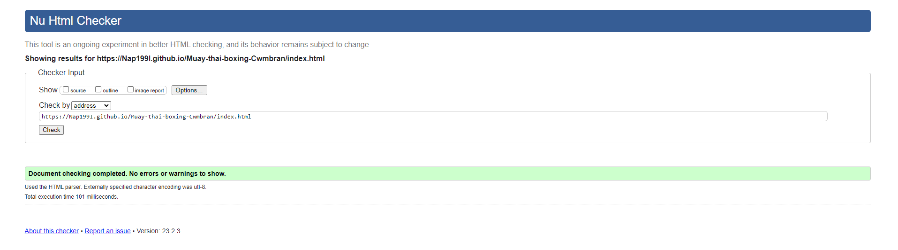
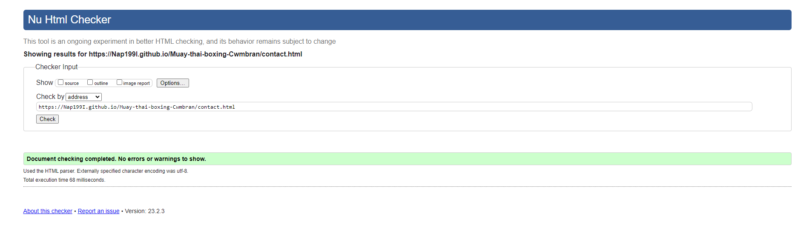
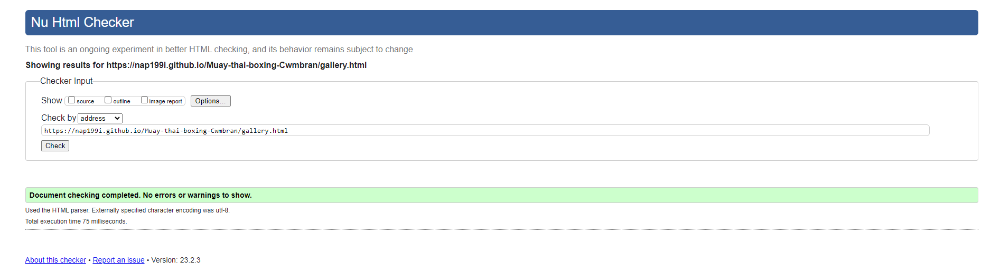
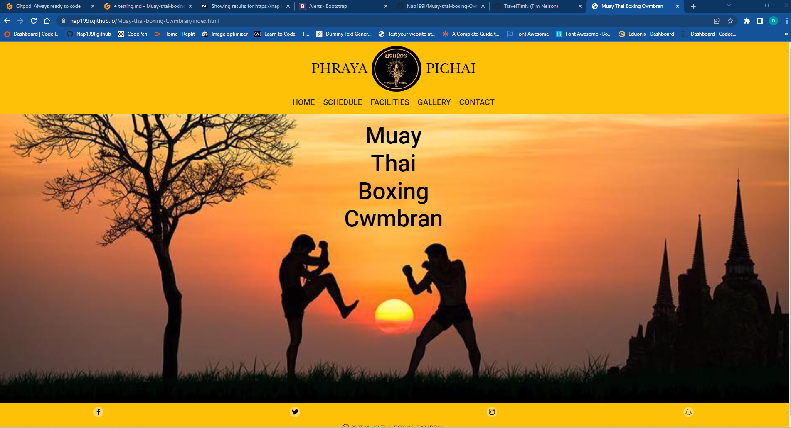
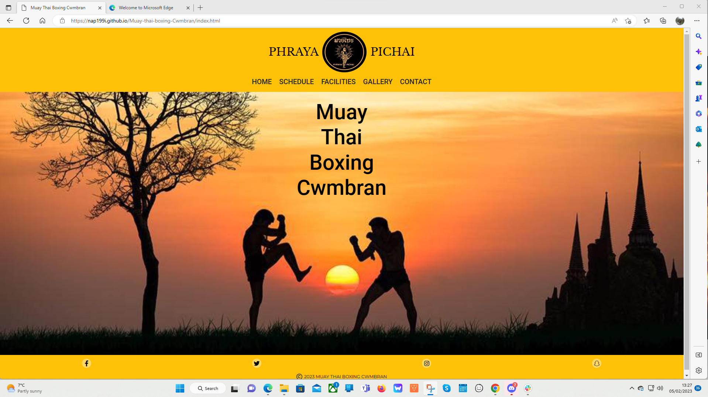

# Testing

Return back to the [README.md](README.md) file.

In this section I will be showing that I have conducted enough testing to legitimately believe that the site works well.
Essentially, in this part, I will be going over all of my project's features to ensure that they all work as intended,
with the project providing an easy and straightforward way for the users to achieve their goals.

## Code Validation

I will use this space to discuss code validation for all of my own code files (where applicable).
I will not validate external libraries/frameworks, such as imported Bootstrap, Font Awesome, etc.

### HTML

I have used the recommended [HTML W3C Validator](https://validator.w3.org) to validate all of my HTML files.

I validated the live pages (each of them) using the deployed URL.
This will give me a custom URL as well, which I will use on my testing documentation.
It makes it easier to return back to a page to validate it again in the future.

| Page | W3C URL | Screenshot | Notes |
| --- | --- | --- | --- |
| Home | [W3C](https://validator.w3.org/nu/?doc=https%3A%2F%2FNap199I.github.io%2FMuay-thai-boxing-Cwmbran%2Findex.html) |  | Pass: No Errors |
| Contact | [W3C](https://validator.w3.org/nu/?doc=https%3A%2F%2FNap199I.github.io%2FMuay-thai-boxing-Cwmbran%2Fcontact.html) |  | Pass: No Errors |
| Schedule | [W3C](https://validator.w3.org/nu/?doc=https%3A%2F%2Fnap199i.github.io%2FMuay-thai-boxing-Cwmbran%2Fschedule.html) |  | Pass: No Errors |
| Facilities | [W3C](https://validator.w3.org/nu/?doc=https%3A%2F%2Fnap199i.github.io%2FMuay-thai-boxing-Cwmbran%2Ffacilities.html) |  | Pass: No Errors |
| Gallery | [W3C](https://validator.w3.org/nu/?doc=https%3A%2F%2Fnap199i.github.io%2FMuay-thai-boxing-Cwmbran%2Fgallery.html) |  | Pass: No Errors |
| confirmation | [W3C](https://validator.w3.org/nu/?doc=https%3A%2F%2Fnap199i.github.io%2FMuay-thai-boxing-Cwmbran%2Fconfirmation.html) |  | Pass: No Errors |

### CSS

I have used the recommended [CSS Jigsaw Validator](https://jigsaw.w3.org/css-validator) to validate my CSS files.

CSS code validation documentation:

| File | Jigsaw URL | Screenshot | Notes |
| --- | --- | --- | --- |
| style.css | [Jigsaw](https://jigsaw.w3.org/css-validator/validator?uri=https%3A%2F%2FNap199I.github.io%2FMuay-thai-boxing-Cwmbran) |  | Pass on personal code: No Errors, the shown error is from the font awesome library as seen in the screenshot and the warnings are from the imported bootstrap and font awesome files. |

## Browser Compatibility

This space will be used to discuss testing of the live/deployed site on various browsers.

Browser testing documentation:

I've tested my deployed project on multiple browsers to check for compatibility issues.

| Browser | Screenshot | Notes |
| --- | --- | --- |
| Chrome |  | Works as expected |
| Firefox |  | Works as expected |
| Edge |  | Works as expected |
| Samsung internet android (samsung galaxy note 20 ultra) |  | Works as expected |
| Brave |  | Works as expected |
| Opera |  | Works as expected |

## Responsiveness

Here i will discuss testing the live/deployed site on various device sizes and screen sizes.

Responsiveness testing documentation:

I've tested my deployed project on devices and DevTools screen sizes to check for responsiveness issues.

| Device | Screenshot | Notes |
| --- | --- | --- |
| Mobile (samsung galaxy note 20 ultra) |  | Works as expected |
| Mobile small (DevTools) |  | Works as expected |
| Mobile medium (DevTools) |  | Works as expected |
| Mobile large (DevTools) |  | Works as expected |
| Tablet (DevTools) |  | Works as expected |
| laptop (DevTools) |  | Works as expected |
| laptop large (DevTools) |  | Works as expected |
| Desktop |  | Works as expected |
| 4K Monitor (DevTools) |  | Works as expected |

## Lighthouse Audit

Here i will discuss testing the live/deployed site's Lighthouse Audit reports.

Lighthouse testing documentation:

I've tested my deployed project using the Lighthouse Audit tool for all of my pages to check for any major issues.

| Page | Size | Screenshot | Notes |
| --- | --- | --- | --- |
| Home | Mobile |  | Few warnings that have been discussed with my mentor (Tim Nelson), I was told that I cannot do anything about them as it is not from my code. |
| Home | Desktop |  | Few warnings that have been discussed with my mentor (Tim Nelson), I was told that I cannot do anything about them as it is not from my code. |
| schedule | Mobile |  | Few warnings that have been discussed with my mentor (Tim Nelson), I was told that I cannot do anything about them as it is not from my code. |
| schedule | Desktop |  | Few warnings that have been discussed with my mentor (Tim Nelson), I was told that I cannot do anything about them as it is not from my code. |
| Gallery | Mobile |  | Few warnings that have been discussed with my mentor (Tim Nelson), I was told that I cannot do anything about them as it is not from my code. |
| Gallery | Desktop |  | Few warnings that have been discussed with my mentor (Tim Nelson), I was told that I cannot do anything about them as it is not from my code. |
| facilities | Mobile |  | Few warnings that have been discussed with my mentor (Tim Nelson), I was told that I cannot do anything about them as it is not from my code. |
| facilities | Desktop |  | Few warnings that have been discussed with my mentor (Tim Nelson), I was told that I cannot do anything about them as it is not from my code. |
| contact | Mobile |  | Few warnings that have been discussed with my mentor (Tim Nelson), I was told that I cannot do anything about them as it is not from my code. |
| contact | Desktop |  | Few warnings that have been discussed with my mentor (Tim Nelson), I was told that I cannot do anything about them as it is not from my code. |
| confirmation | Mobile |  | Few warnings that have been discussed with my mentor (Tim Nelson), I was told that I cannot do anything about them as it is not from my code. |
| confirmation | Desktop |  | Few warnings that have been discussed with my mentor (Tim Nelson), I was told that I cannot do anything about them as it is not from my code. |

## User Story Testing

| User Story | Screenshot |
| --- | --- |
| As a new site user, I would like to find out the location, so that I can join the camp. |  |
| As a new site user, I would like to find out the schedule, so that I can join the camp. |  |
| As a new site user, I would like to contact the camp administration, so that I can ask any questions I may have. |  |
| As a new site user, I would like to find the price of the sessions, so that I can pay the correct amount when I join. |  |
| As a new site user, I would like to find information on the sessions, so that I can pick which ones to attend. |  |
| As a returning site user, I would like to find the schedule, so that I can make sure there has been no changes. |  |
| As a returning site user, I would like to look at the gallery, so that I can show people my friends and what I am a part of. |  |
| As a returning site user, I would like to use the contact section, so that I can inform the instructor that I wont be able to make a session. |  |
| As a site administrator, I should be able to have our information displayed, so that I can update new and existing members on times, locations and prices. |  |
| As a site administrator, I should be able to have images on the site, so that I can so potential new recruits can see what we do or so existing members can show friends. |  |
| As a site administrator, I should be able to recieve and answer queries by email, so that I can assist anyone looking to join or any existing members issues. |  |

## Bugs

It's very important to document any bugs you've discovered while developing the project.
Make sure to include any necessary steps you've implemented to fix the bug(s) as well.

For JavaScript and Python applications, it's best to screenshot the errors to include them as well.

**PRO TIP**: screenshots of bugs are extremely helpful, and go a long way!

- JS Uncaught ReferenceError: `foobar` is undefined/not defined

    

    - To fix this, I _____________________.

- JS `'let'` or `'const'` or `'template literal syntax'` or `'arrow function syntax (=>)'` is available in ES6 (use `'esversion: 11'`) or Mozilla JS extensions (use moz).

    

    - To fix this, I _____________________.

- Python `'ModuleNotFoundError'` when trying to import module from imported package

    

    - To fix this, I _____________________.

- Django `TemplateDoesNotExist` at /appname/path appname/template_name.html

    

    - To fix this, I _____________________.

- Python `E501 line too long` (93 > 79 characters)

    

    - To fix this, I _____________________.

### GitHub **Issues**

An improved way to manage bugs is to use the built-in **Issues** tracker on your GitHub repository.
To access your Issues, click on the "Issues" tab at the top of your repository.
Alternatively, use this link: https://github.com/Nap199I/Muay-thai-boxing-Cwmbran/issues

If using the Issues tracker for your bug management, you can simplify the documentation process.
Issues allow you to directly paste screenshots into the issue without having to first save the screenshot locally,
then uploading into your project.

You can add labels to your issues (`bug`), assign yourself as the owner, and add comments/updates as you progress with fixing the issue(s).

Once you've sorted the issue, you should then "Close" it.

When showcasing your bug tracking for assessment, you can use the following format:

**Fixed Bugs**

All previously closed/fixed bugs can be tracked [here](https://github.com/Nap199I/Muay-thai-boxing-Cwmbran/issues?q=is%3Aissue+is%3Aclosed).

| Bug | Status |
| --- | --- |
| [JS Uncaught ReferenceError: `foobar` is undefined/not defined](https://github.com/Nap199I/Muay-thai-boxing-Cwmbran/issues/1) | Closed |
| [Python `'ModuleNotFoundError'` when trying to import module from imported package](https://github.com/Nap199I/Muay-thai-boxing-Cwmbran/issues/2) | Closed |
| [Django `TemplateDoesNotExist` at /appname/path appname/template_name.html](https://github.com/Nap199I/Muay-thai-boxing-Cwmbran/issues/3) | Closed |

**Open Issues**

Any remaining open issues can be tracked [here](https://github.com/Nap199I/Muay-thai-boxing-Cwmbran/issues).

| Bug | Status |
| --- | --- |
| [JS `'let'` or `'const'` or `'template literal syntax'` or `'arrow function syntax (=>)'` is available in ES6 (use `'esversion: 11'`) or Mozilla JS extensions (use moz).](https://github.com/Nap199I/Muay-thai-boxing-Cwmbran/issues/4) | Open |
| [Python `E501 line too long` (93 > 79 characters)](https://github.com/Nap199I/Muay-thai-boxing-Cwmbran/issues/5) | Open |

## Unfixed Bugs

You will need to mention unfixed bugs and why they were not fixed.
This section should include shortcomings of the frameworks or technologies used.
Although time can be a big variable to consider, paucity of time and difficulty understanding
implementation is not a valid reason to leave bugs unfixed.

If you've identified any unfixed bugs, no matter how small, be sure to list them here.
It's better to be honest and list them, because if it's not documented and an assessor finds the issue,
they need to know whether or not you're aware of them as well, and why you've not corrected/fixed them.

Some examples:

- On devices smaller than 375px, the page starts to have `overflow-x` scrolling.

    

    - Attempted fix: I tried to add additional media queries to handle this, but things started becoming too small to read.

- For PP3, when using a helper `clear()` function, any text above the height of the terminal does not clear, and remains when you scroll up.

    

    - Attempted fix: I tried to adjust the terminal size, but it only resizes the actual terminal, not the allowable area for text.

- When validating HTML with a semantic `section` element, the validator warns about lacking a header `h2-h6`. This is acceptable.

    

    - Attempted fix: this is a known warning and acceptable, and my section doesn't require a header since it's dynamically added via JS.

If you legitimately cannot find any unfixed bugs or warnings, then use the following sentence:

There are no remaining bugs that I am aware of.
